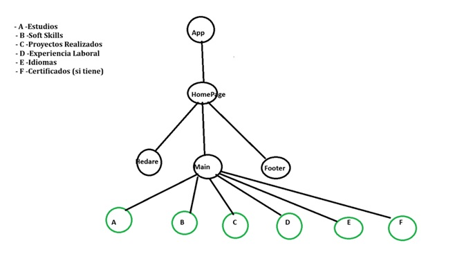

# 📘 Trabajo Práctico N.º 1 – Programación 4 (Año 2025)

**Profesor:** Matías Sebastián Chocobar  
**Carrera:** Tecnicatura Universitaria en Programación  
**Tema:** Proyecto Portfolio con React + Vite + GitHub

---

## 🎯 Objetivos

- Comprender y aplicar la estructura básica de una aplicación **React con Vite 7+**.  
- Desarrollar **componentes reutilizables y organizados**.  
- Establecer relaciones entre componentes (padre e hijo).  
- Incorporar **estilos mediante CSS o Tailwind CSS**.  
- Utilizar **Git y GitHub** como herramientas de control de versiones profesionales.

---

## 📝 Consigna (descripción del trabajo)

Cada alumno deberá realizar y entregar un **proyecto individual** en **React (Vite)** que funcione como **portfolio personal**, siguiendo la **estructura de carpetas**, la **distribución de componentes** y las **buenas prácticas** indicadas abajo.  
Se evaluará: organización de componentes, uso de props, manejo de listas con `.map()`, navegación/secciones internas, y presentación visual.

**Componentes requeridos (mínimo):**
- **Componente Padre:** `Home.jsx`
- **Componentes Hijos de `Home`:**
  - `Header.jsx`: portada con imagen personal y `<h1>` con **Nombre y Apellido**.
  - `Main.jsx`: presentación personal (breve bio) y secciones:
    - A — **Estudios**
    - B — **Soft Skills**
    - C — **Proyectos Realizados**
    - D — **Experiencia Laboral**
    - E — **Idiomas**
    - F — **Certificados** (si tiene)
    - 👉 Al menos **2** de estas secciones deben estar separadas como **componentes adicionales** y ser navegables mediante anclas/links internos.
  - `Footer.jsx`: enlaces a **LinkedIn**, **GitHub** y/o navegación interna.
- Se recomienda usar **arreglos de objetos + `.map()`** para renderizar información dinámica.

---

## 📁 Estructura sugerida del proyecto

```
src/
│
├── components/
│   ├── Header.jsx
│   ├── Main.jsx
│   ├── Footer.jsx
│   ├── Estudios.jsx
│   ├── SoftSkills.jsx
│   ├── Proyectos.jsx
│   ├── Experiencia.jsx
│   ├── Idiomas.jsx
│   └── Certificados.jsx
│
├── pages/
│   └── Home.jsx
│
├── App.jsx
└── styles/
    └── App.css
```

📸 **DOM Virtual (clave para entender React):**  
> Usar la imagen incluida en el proyecto para la explicación en clase.



> Si tu archivo tiene otro nombre o ruta, actualizá el path en el README.

---

## 🎨 Estilos

Podés usar **CSS tradicional**, **Bootstrap** o **Tailwind CSS**.  
Se evaluará la **estética**, la **consistencia visual** y la **organización** del CSS.

---

## 🚀 FLUJO DE TRABAJO OBLIGATORIO CON GIT Y GITHUB

📦 **Repositorio base:**  
👉 https://github.com/ChocobarMatias/TP_Comison_7_TUP

> ⚠️ **IMPORTANTE (hacer antes de empezar a codear):**  
> Cada alumno debe crear su **carpeta personal** dentro de la carpeta **TP-Alumnos** y **dentro de esa carpeta** iniciar el proyecto con **Vite**.

### 1) Hacer Fork del repositorio del profesor
Desde el link anterior, presionar **Fork** (arriba a la derecha).

### 2) Clonar tu fork en Visual Studio Code
```bash
git clone https://github.com/TU_USUARIO/TP_Comison_7_TUP.git
cd TP_Comison_7_TUP
```

### 3) Crear carpeta personal (**ANTES DE TRABAJAR**)
> ⚠️ Paso obligatorio
```
ApellidoNombre_Legajo/
```
Ejemplo: `PerezJuan_12345/`

### 4) Iniciar React + Vite **dentro de tu carpeta personal**
```bash
cd ApellidoNombre_Legajo
npm create vite@latest .
npm install
npm run dev
```

### 5) Crear tu **rama de desarrollo**
```bash
git checkout -b ApellidoNombre_Legajo
```

### 6) Commits descriptivos y push
```bash
git add .
git commit -m "feat: Header con imagen personal y título"
git push origin ApellidoNombre_Legajo
```

### 7) Pull Request (PR) para entregar
Abrir un **PR** hacia el repo del profesor con el título:
```
Entrega TP1 - Apellido Nombre - Legajo
```

---

## 🧱 Flujo de ramas recomendado

| Rama | Uso |
|------|-----|
| `main` | Rama principal del profesor |
| `ApellidoNombre_Legajo` | Rama personal del alumno (desarrollo) |
| `subramas` | Ramas temporales para subtareas (opcional) |

💡 Integra tus subramas a tu rama personal cuando termines cada subtarea:
```bash
git merge subrama
git push origin ApellidoNombre_Legajo
```

---


## 🎨 Parte 2 – Estilos
Aplicar estilos con CSS tradicional o módulos. El proyecto debe tener una estética agradable, creativa y organizada.


---

## 💻 Requisitos de control de versiones

- Al menos **5 commits significativos** (con mensajes claros).  
- Trabajo **siempre** en tu rama `ApellidoNombre_Legajo`.  
- **Entrega por PR** hacia el repositorio del profesor.

---

## 📦 Entrega

- Enlace a tu **repositorio GitHub personal** (fork).  
- **NO** se acepta entrega por `.zip` o `.rar` (todo por Git y PR).  
- **Fecha límite:** Viernes 17 de octubre de 2025 – hasta las 18:00 hs.

---

> 📬 Dudas y consultas: **Prof. Matías Sebastián Chocobar**
